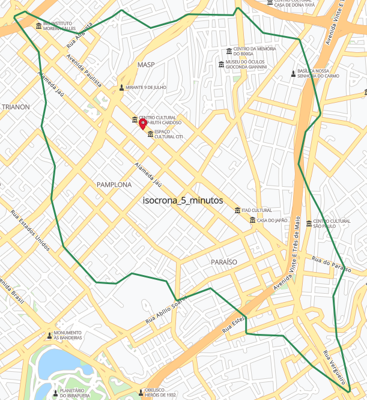
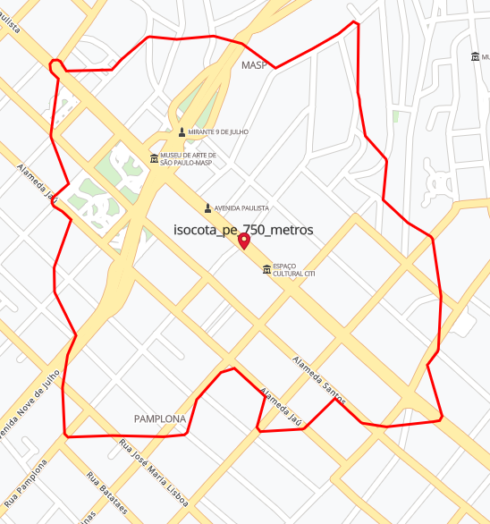
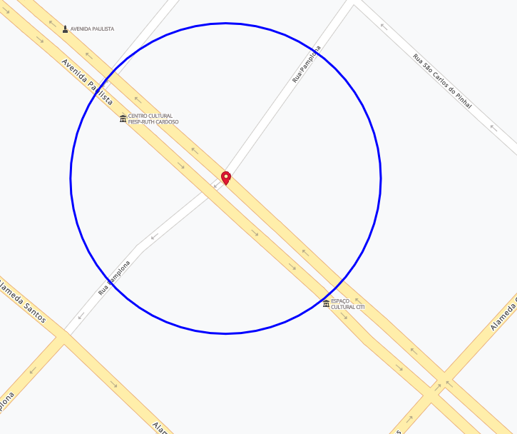

OnData
==============================

Projeto para exemplificar a utilização do OnData para enriquecimento de uma base
de endereços.


Exemplo de Uso
------------

```
from src.data import make_dataset
token = 'Bearer kçksdçfkdsçfksdçf' # Preeencher com o token do OnData
df_data = make_dataset.main(token)
```

Sobre as geometrias de enriquecimento
------------

Vale destacar alguns parâmetros utilizados para gerar as geometrias dos dados do
OnData. Basicamente, existem 3 tipos de geometrias:

* Isócrona

Áreas definidas por um tempo de deslocamento fixo, considerando as vias urbanas. Ou seja partindo de um ponto, a área é definida por um tempo de deslocamento em
X minutos. Este deslocamento pode ser feito de carro ou pé. Além disso, a geometria pode ser gerada saindo do ponto ou chegando ao mesmo.

Abaixo pode ser visto um exemplo da área definida por uma isócrona de 5
minutos saindo da esquina entre Av. Paulista e Rua Pamplona.



* Isocota ( ou Isolinha)

É uma área que assim como a isócrona e gerada por um deslocamento fixo que
respeita o deslocamento nas vias. A diferença reside no fato do valor de
deslocamento não ser por tempo, mas sim por uma distância em metros. Novamente,
o deslocamento pode ser feito carro ou a pé.

Abaixo pode ser visto um exemplo da área definida por uma isocota de 1000 metros
a partir da esquina da Av. Paulista com a Rua Pamplona.



* Buffer (ou raio)

É uma área definida por um raio. Assim, o único parâmetro desta área é o valor
do raio. Diferente das outras áreas, o buffer não considera o deslocamento nas
vias para gerar a área.

Abaixo pode ser visto o exemplo de um buffer de 100 metros centrado na esquina
da Av. Paulista com a Rua Pomplona.




Sobre a contagem de POIs e cálculo proporcional
-------------------------

Uma vez definida a geometria de enriquecimento, cada ponto será enriquecido com
a geometria gerada com os parâmetros escolhidos para cada ponto. Assim, os POIs
(Points of Interest) serão contados por todos aqueles que estão contidos dentro
da geometria. Já os valores de sociodemografia e potencial de consumo, será
feito o cálculo proporcional entre a geometria e os pontos. Para uma maior
compreensão de como e feito este cálculo proporcional este
[link](https://medium.com/geo-tech/manipulando-dados-geoespaciais-em-python-9fe21dda5894 "GeoTech") pode ser consultado.

Sobre a costumização do enriquecimento
------------------------

Existem diversas opções de enriquecimento parametrizadas no método main do
módulo make\_dataset. Alterando-as é possível alterar as opções default de
enriquecimento.
